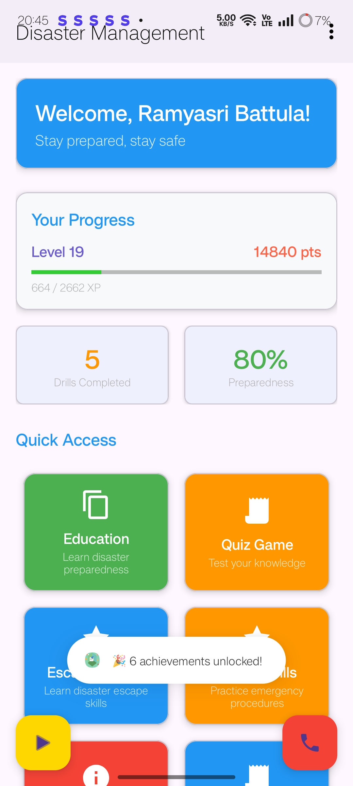
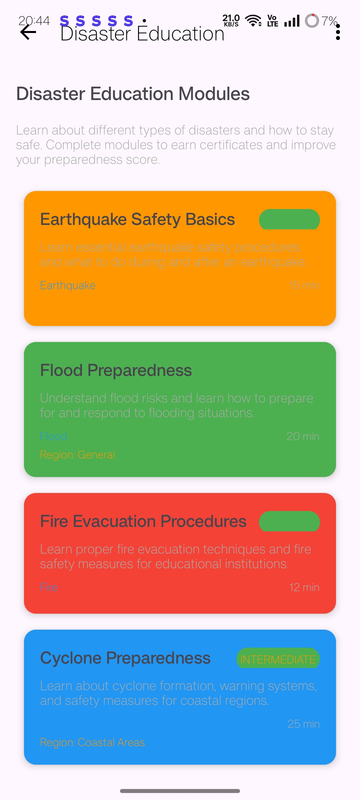
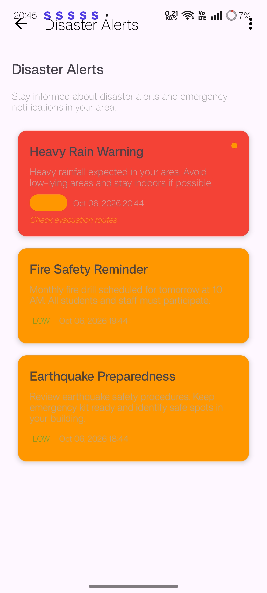
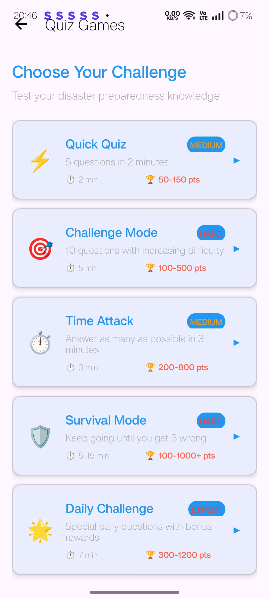
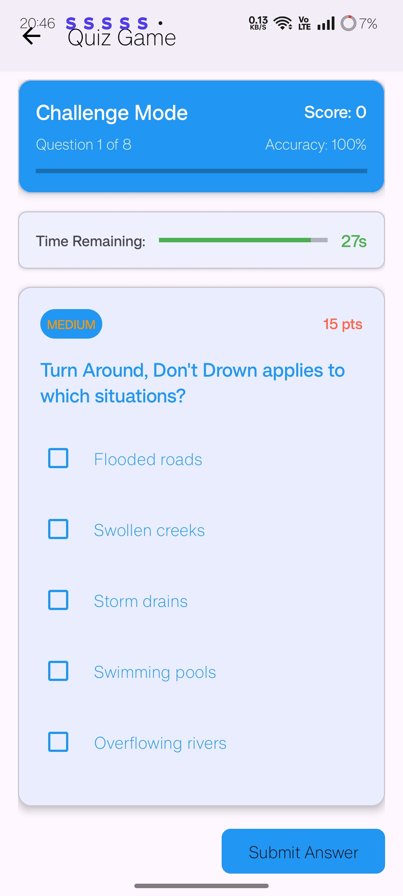
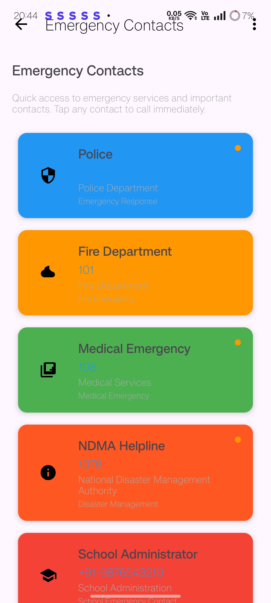
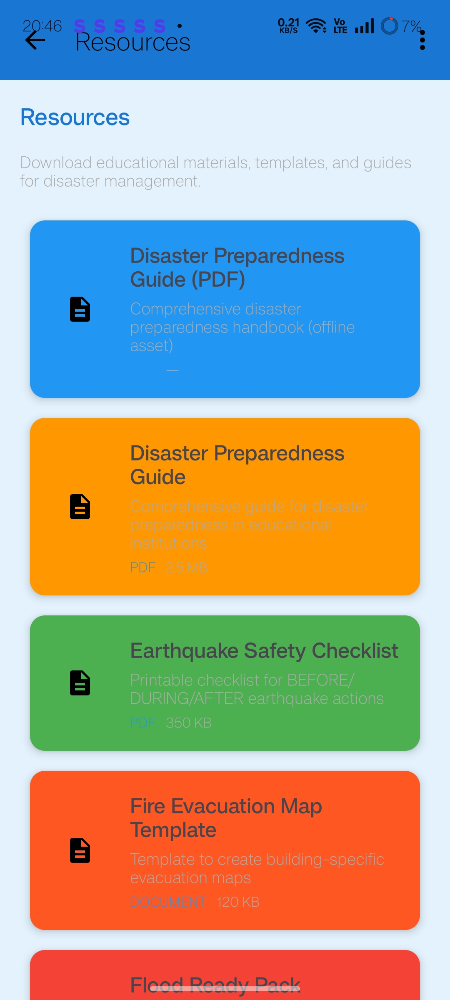
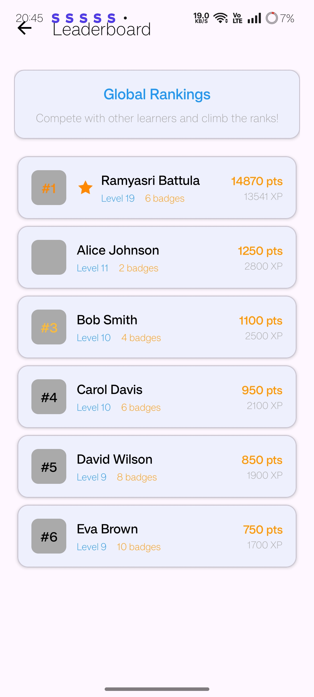
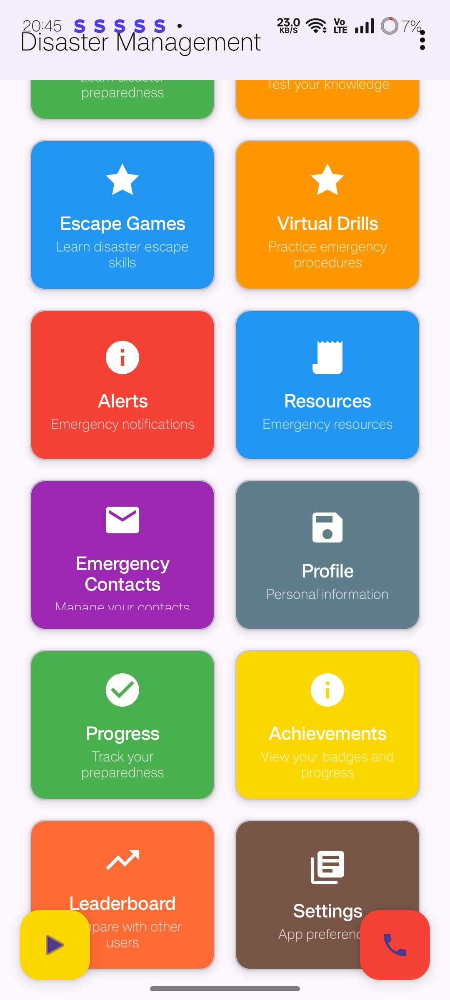

# 🚨 Disaster Management & Preparedness App

An Android app that teaches students and staff how to prepare for and respond to disasters through learning modules, quiz games, virtual drills, live-style alerts, and quick access to emergency contacts. Progress is gamified with levels, points, achievements, and a leaderboard.

Built for **Smart India Hackathon**.

---

## 🚀 Features

* 🏠 **Dashboard:** personalised welcome, level, points, XP bar, drills completed, and overall preparedness score
* 📚 **Disaster Education:** modules on earthquake, flood, fire evacuation, and cyclone safety, with duration, difficulty, and region
* 🧠 **Quiz Games:** Quick Quiz, Challenge Mode, Time Attack, Survival Mode, and Daily Challenge with timers, scoring, and accuracy tracking
* 🎮 **Escape Games & Virtual Drills:** practice emergency procedures in a safe environment
* 🚨 **Disaster Alerts:** severity-coded alerts (e.g. heavy rain warnings, fire drill reminders) with timestamps and recommended actions
* 📞 **Emergency Contacts:** one-tap calling for Police, Fire (101), Medical (108), NDMA Helpline (1078), and school administration
* 📄 **Resources:** downloadable guides, earthquake safety checklist, fire evacuation map template, and flood-ready pack
* 🏆 **Achievements & Leaderboard:** earn badges, gain XP, and compete with other learners
* 📈 **Progress Tracking:** monitor preparedness over time
* 👤 **Profile & Settings:** personal information and app preferences

---

## 🛠️ Tech Stack

* **Platform:** Android
* **Language:** Kotlin
* **IDE:** Android Studio
* **Build Tool:** Gradle (Kotlin DSL)

---

## 📸 Screenshots

| Home | Education | Alerts |
|------|-----------|--------|
|  |  |  |

| Quiz Modes | Quiz Question | Emergency Contacts |
|------------|---------------|--------------------|
|  |  |  |

| Resources | Leaderboard | Quick Access |
|-----------|-------------|--------------|
|  |  |  |

---

## ⚙️ Installation & Setup

1. Clone the repository
```bash
   git clone https://github.com/ramyasribattula/DISASTER-PREPAREDNESS-SYSTEM.git
```
2. Open the folder in **Android Studio** (File → Open).
3. Wait for Gradle to sync.
4. Connect an Android device or start an emulator, then click **Run ▶**.

---

## 🔮 Future Improvements

* Real-time alerts from government disaster APIs
* Offline mode for areas with poor connectivity
* Multi-language support
* AR-based virtual drills

---

## 👩‍💻 Author

**Ramya Sri Battula**
GitHub: https://github.com/ramyasribattula

---

⭐ If you like this project, give it a star!
